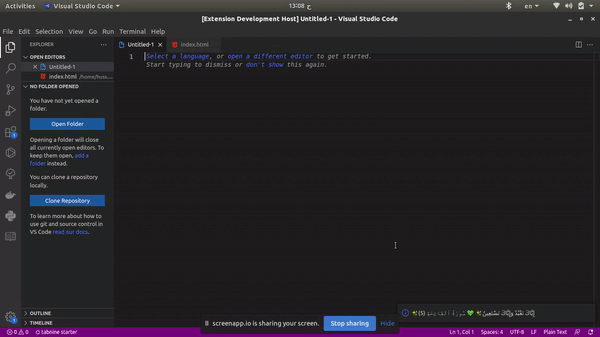

**Align center:**

# Ayat

Get an verse(aya) from the Quran during your coding session 💻 , stay connected with the words of Allah. 💚 🕋

## Release Notes

### 1.0.0

- Get random aya from quran ✅
- Arabic supported . ✅
- offline mode supported. ✅
- emojis supported ✅

## Incoming features

- multi language support. 

## For more information

* [Personal website ](https://hussamadil.com)
* [Quran Api](https://alquran.cloud/api)

**Enjoy!**

